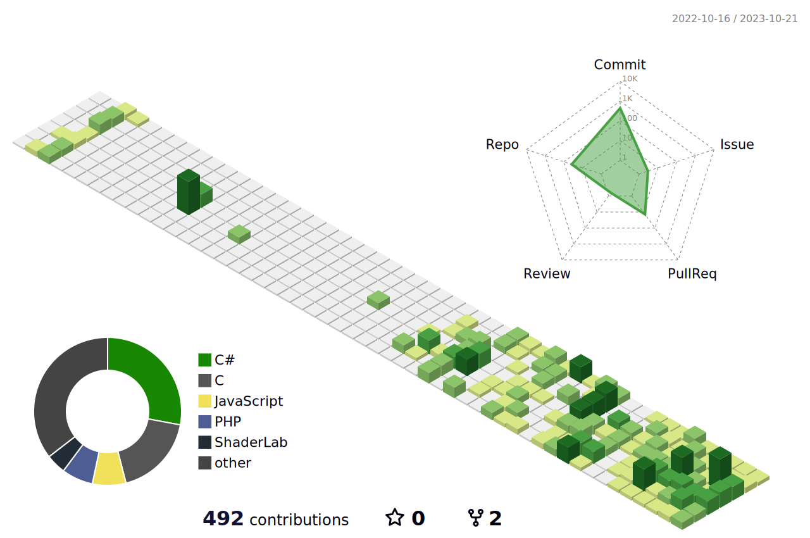

  

<h1 align="center">👋 Welcome to my Github! 👋</h1>

 

 
 

<h2 align="center">🧡 Connect with me 🧡</h2>

  
  
  
  
  

<h2 align=center>💻 Tech Stack 💻</h2>

 
   

<h2 align=center>🌱 I’m currently learning ...🌱</h2>

 
   

<h3 align=center>📈 GitHub Stats 📈</h3>

  
 

   

<h2 align=center>🔥 Streak Stats 🔥</h2>

  

<h2 align="center">💡 PS 💡</h2>

 
   

<h2 align=center>🏆 GitHub Trophies 🏆</h2>

  

<!-- Snake -->

  

